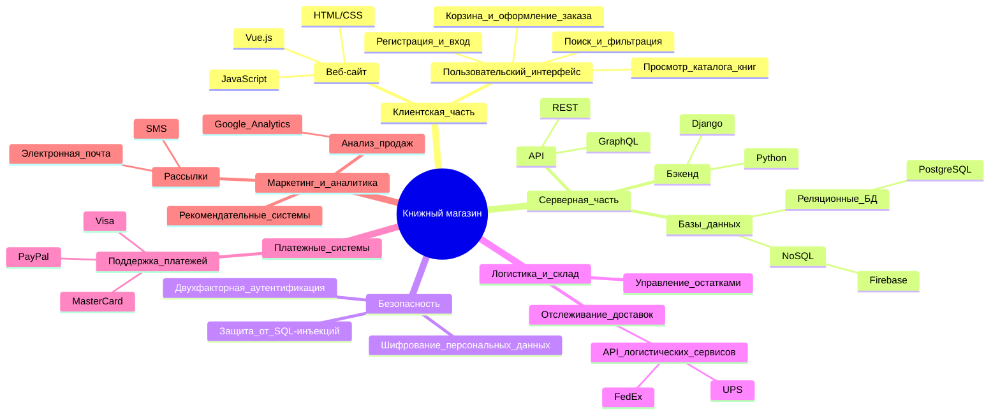
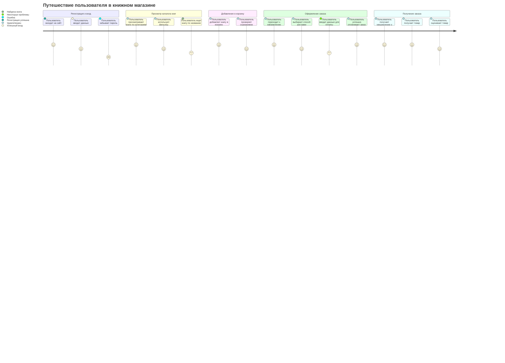
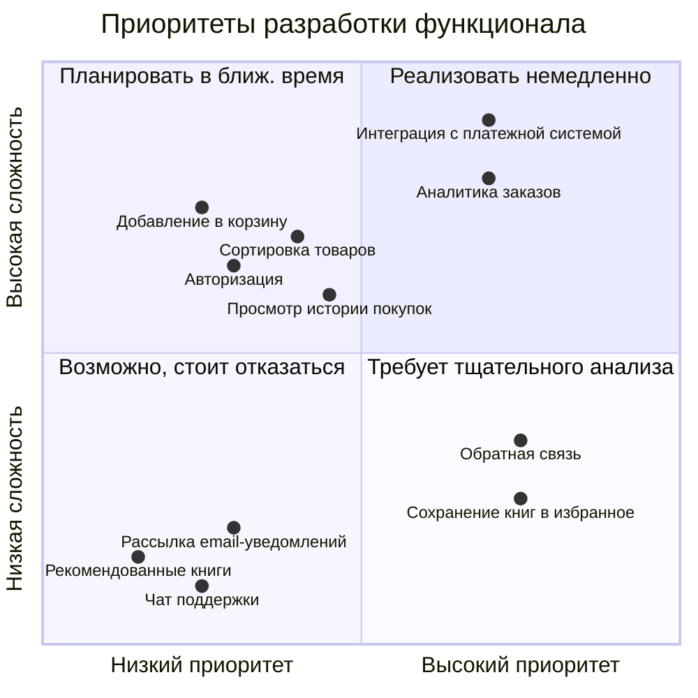
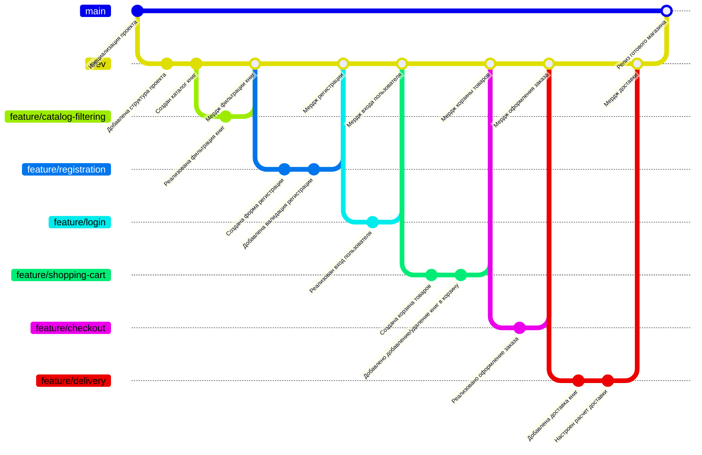

# Книжный магазин

Добро пожаловать в проект "Книжный магазин"! Этот репозиторий содержит диаграммы и информацию, иллюстрирующую архитектуру, функциональность и процесс разработки системы.

## Mindmap: Общая структура проекта

### Пояснение
Диаграмма демонстрирует основные компоненты системы, от клиентской и серверной частей до маркетинга и аналитики. Каждый раздел включает подкомпоненты и ключевые технологии.

---

## Journey: Путешествие пользователя в книжном магазине

### Пояснение
Диаграмма описывает шаги взаимодействия пользователя с магазином, от регистрации до получения заказа. Каждый шаг оценивается по шкале удовлетворенности.

---

## Quadrant Chart: Приоритеты разработки функционала

### Пояснение
Диаграмма показывает распределение задач по приоритетам и сложности. Это помогает определить, какие функции реализовать в первую очередь.

---

## GitGraph: Процесс разработки проекта

### Пояснение
Диаграмма иллюстрирует процесс разработки с использованием системы контроля версий. Отображены ветки разработки, их слияния и этапы релиза.

--- 
