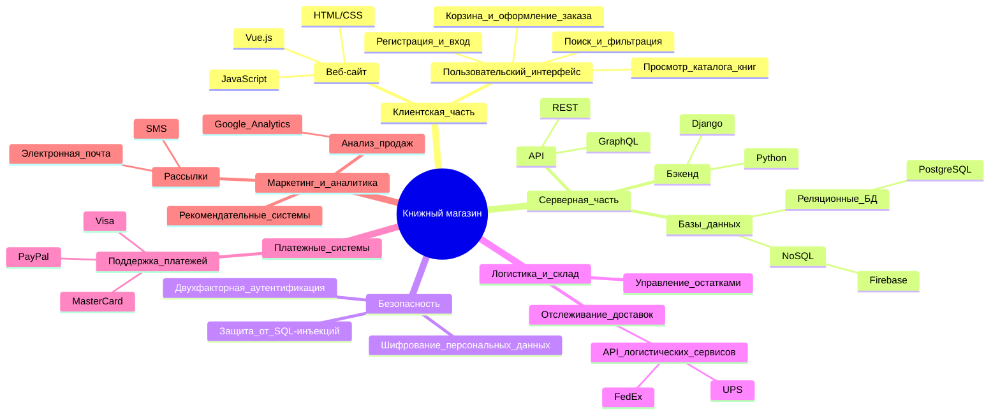
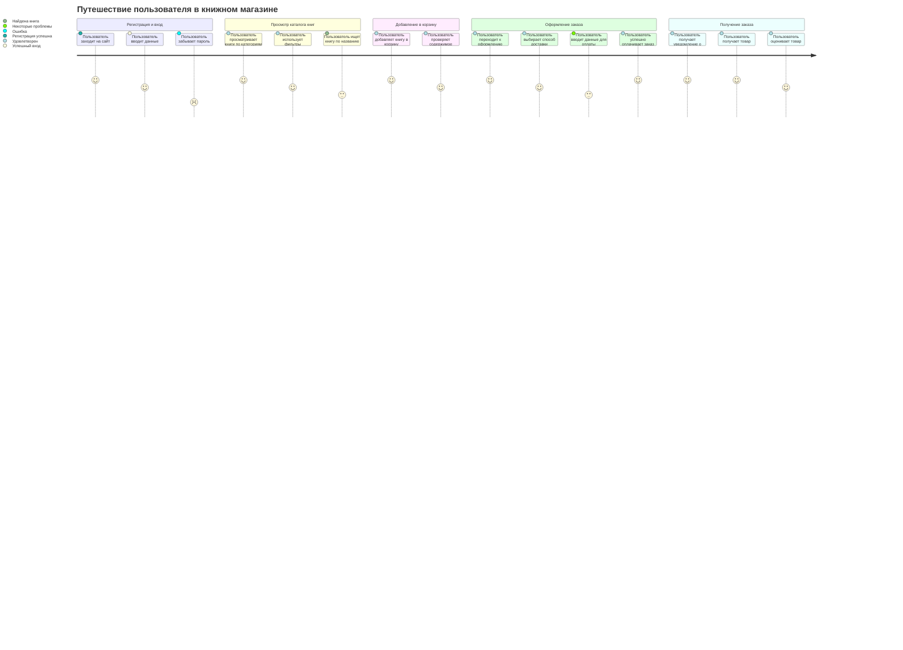
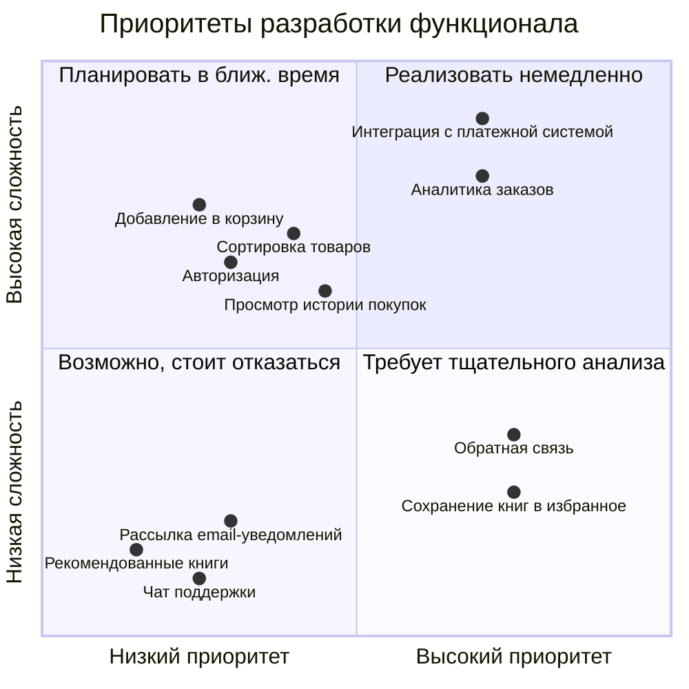
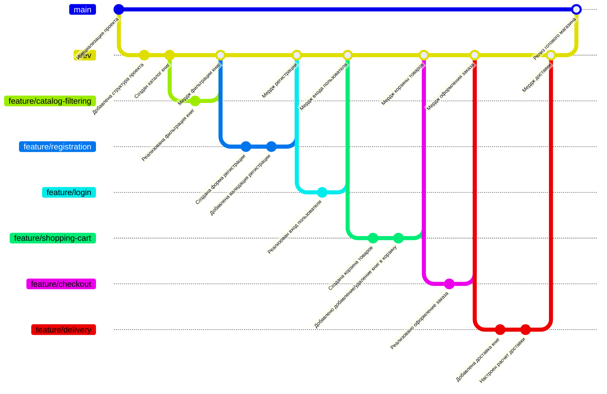

# Книжный магазин

Этот репозиторий содержит диаграммы, которые наглядно демонстрируют архитектуру, функциональность и процесс разработки. Каждая диаграмма сопровождается подробным пояснением для лучшего понимания.

---

## Mindmap: Общая структура проекта

### Пояснение
Эта диаграмма является концептуальной картой проекта и демонстрирует все ключевые компоненты системы:

1. **Клиентская часть**: 
   - Включает в себя веб-сайт, который разрабатывается с использованием HTML/CSS, JavaScript и Vue.js. 
   - Также описан пользовательский интерфейс, охватывающий функционал от регистрации и входа до оформления заказа.

2. **Серверная часть**:
   - Разработка backend на Python с использованием фреймворка Django.
   - Работа с базами данных, как реляционными (PostgreSQL), так и NoSQL (Firebase).
   - Предоставление API для взаимодействия, включая REST и GraphQL.

3. **Безопасность**:
   - Основное внимание уделяется защите данных, предотвращению SQL-инъекций и реализации двухфакторной аутентификации.

4. **Логистика и склад**:
   - Включает управление остатками, отслеживание доставок и взаимодействие с API логистических сервисов (FedEx, UPS).

5. **Платежные системы**:
   - Описывает поддержку популярных платежных систем, таких как Visa, MasterCard и PayPal.

6. **Маркетинг и аналитика**:
   - Функционал для анализа продаж, рекомендаций и отправки рассылок (через электронную почту и SMS).

---

## Journey: Путешествие пользователя в книжном магазине

### Пояснение
Диаграмма иллюстрирует пользовательский путь — процесс взаимодействия клиента с магазином:

- **Регистрация и вход**:
  - Пользователь начинает взаимодействие с сайта. Диаграмма отражает возможные проблемы (например, ошибки при вводе данных).

- **Просмотр каталога книг**:
  - Описываются варианты взаимодействия с каталогом: поиск книг, использование фильтров, просмотр по категориям.

- **Добавление в корзину**:
  - Включает этапы добавления товаров в корзину и проверки её содержимого.

- **Оформление заказа**:
  - Детализируется процесс выбора способа доставки, ввода данных для оплаты, а также возможные сложности на этом этапе.

- **Получение заказа**:
  - Завершающий этап включает уведомление о доставке, получение товара и обратную связь клиента.

---

## Quadrant Chart: Приоритеты разработки функционала

### Пояснение
Диаграмма помогает приоритизировать задачи, разделяя их по сложности и важности:

1. **Квадрант 1 (Реализовать немедленно)**:
   - Функционал, простой в реализации и имеющий высокую важность (например, добавление в корзину).

2. **Квадрант 2 (Планировать в ближайшее время)**:
   - Задачи средней сложности, которые при этом обладают высокой ценностью (например, обратная связь).

3. **Квадрант 3 (Возможно, стоит отказаться)**:
   - Задачи с низким приоритетом и сложностью, которые могут не приносить пользы (например, рекомендованные книги).

4. **Квадрант 4 (Требует тщательного анализа)**:
   - Задачи с высокой сложностью и приоритетом, которые требуют значительных ресурсов (например, аналитика заказов).

---

## GitGraph: Процесс разработки проекта

### Пояснение
Эта диаграмма демонстрирует процесс разработки с использованием системы контроля версий Git:

- Ветки разделяются для разработки новых функций, что обеспечивает изоляцию кода.
- После завершения разработки, функции объединяются с основной веткой dev.
- Когда функционал полностью протестирован, он добавляется в основную ветку main для релиза.

Такой подход способствует управляемому и структурированному процессу разработки.
