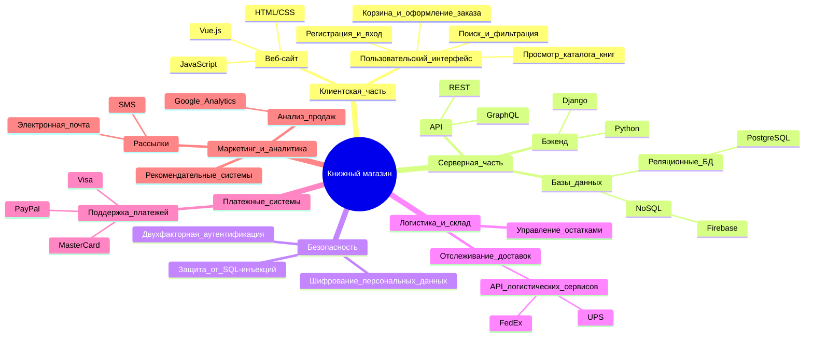
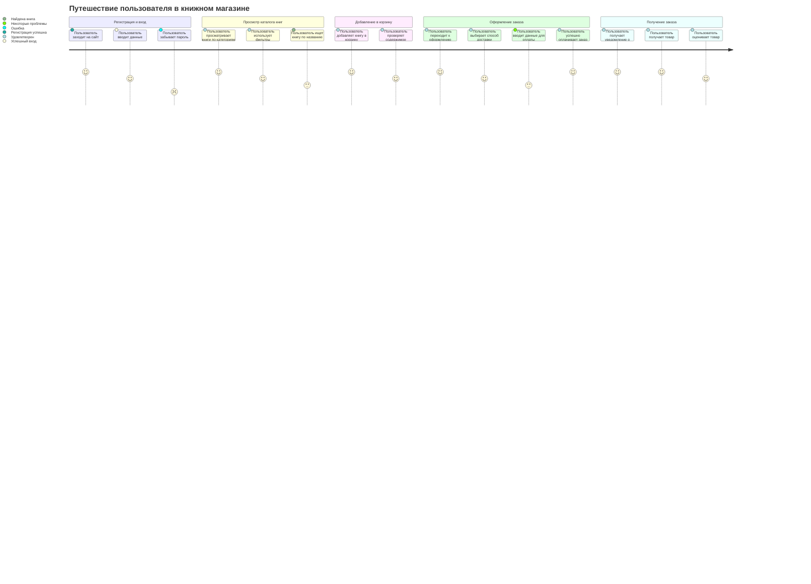
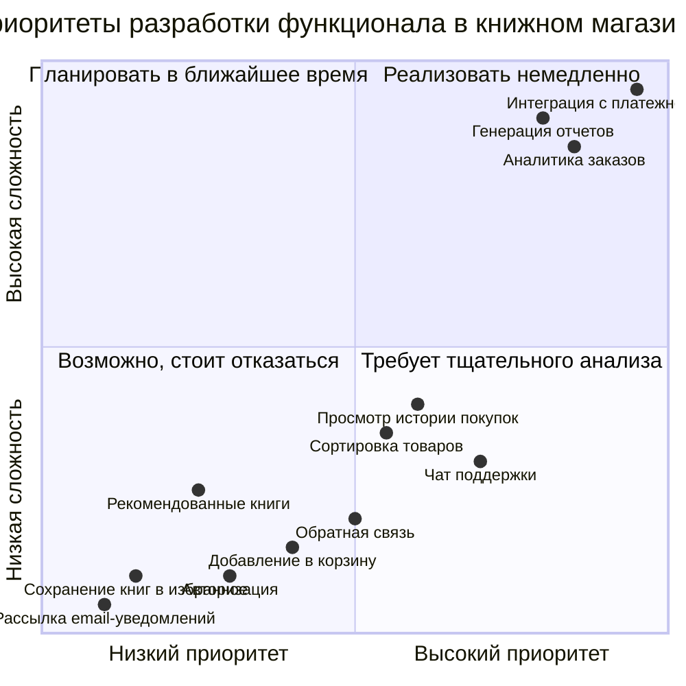

# Книжный магазин

## Mindmap

```mermaid
mindmap
  root((Книжный магазин))
    Клиентская_часть
      Веб-сайт
        HTML/CSS
        JavaScript
        Vue.js
      Пользовательский_интерфейс
        Регистрация_и_вход
        Просмотр_каталога_книг
        Поиск_и_фильтрация
        Корзина_и_оформление_заказа
    Серверная_часть
      Бэкенд
        Python
        Django
      Базы_данных
        Реляционные_БД
          PostgreSQL
        NoSQL
          Firebase
      API
        REST
        GraphQL
    Безопасность
      Шифрование_персональных_данных
      Защита_от_SQL-инъекций
      Двухфакторная_аутентификация
    Логистика_и_склад
      Управление_остатками
      Отслеживание_доставок
        API_логистических_сервисов
          FedEx
          UPS
    Платежные_системы
      Поддержка_платежей
        Visa
        MasterCard
        PayPal
    Маркетинг_и_аналитика
      Рекомендательные_системы
      Анализ_продаж
        Google_Analytics
      Рассылки
        Электронная_почта
        SMS
```

```mermaid
journey
    title Путешествие пользователя в книжном магазине
    section Регистрация и вход
      Пользователь заходит на сайт: 5: Регистрация успешна
      Пользователь вводит данные: 4: Успешный вход
      Пользователь забывает пароль: 2: Ошибка
    section Просмотр каталога книг
      Пользователь просматривает книги по категориям: 5: Удовлетворен
      Пользователь использует фильтры: 4: Удовлетворен
      Пользователь ищет книгу по названию: 3: Найдена книга
    section Добавление в корзину
      Пользователь добавляет книгу в корзину: 5: Удовлетворен
      Пользователь проверяет содержимое корзины: 4: Удовлетворен
    section Оформление заказа
      Пользователь переходит к оформлению заказа: 5: Удовлетворен
      Пользователь выбирает способ доставки: 4: Удовлетворен
      Пользователь вводит данные для оплаты: 3: Некоторые проблемы
      Пользователь успешно оплачивает заказ: 5: Удовлетворен
    section Получение заказа
      Пользователь получает уведомление о доставке: 5: Удовлетворен
      Пользователь получает товар: 5: Удовлетворен
      Пользователь оценивает товар: 4: Удовлетворен
```

```mermaid
quadrantChart
    title Приоритеты разработки функционала в книжном магазине
    x-axis "Низкий приоритет" --> "Высокий приоритет"
    y-axis "Низкая сложность" --> "Высокая сложность"
    quadrant-1 "Реализовать немедленно"
    quadrant-2 "Планировать в ближайшее время"
    quadrant-3 "Возможно, стоит отказаться"
    quadrant-4 "Требует тщательного анализа"
    "Чат поддержки": [0.70, 0.30]
    "Обратная связь": [0.50, 0.20]
    "Просмотр истории покупок": [0.60, 0.40]
    "Генерация отчетов": [0.80, 0.90]
    "Аналитика заказов": [0.85, 0.85]
    "Интеграция с платежной системой": [0.95, 0.95]
    "Добавление в корзину": [0.40, 0.15]
    "Авторизация": [0.30, 0.10]
    "Сортировка товаров": [0.55, 0.35]
    "Рекомендованные книги": [0.25, 0.25]
    "Сохранение книг в избранное": [0.15, 0.10]
    "Рассылка email-уведомлений": [0.10, 0.05]


```

